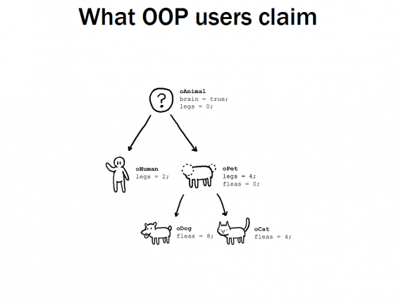
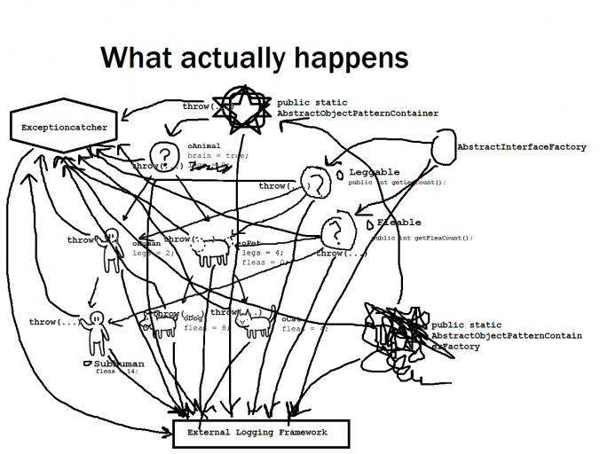
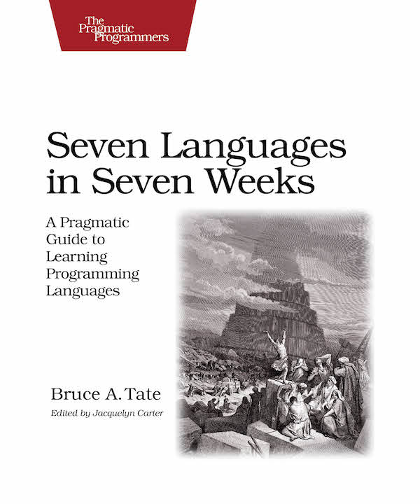
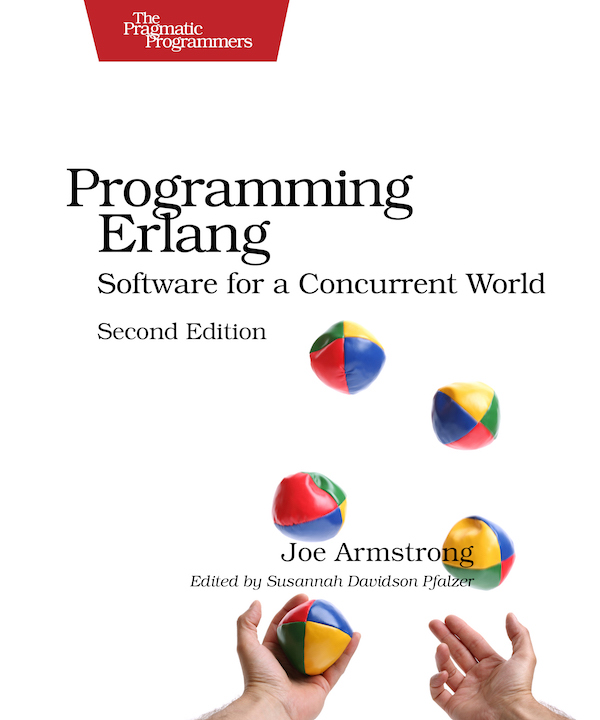
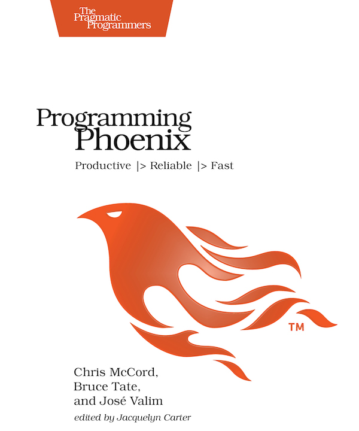
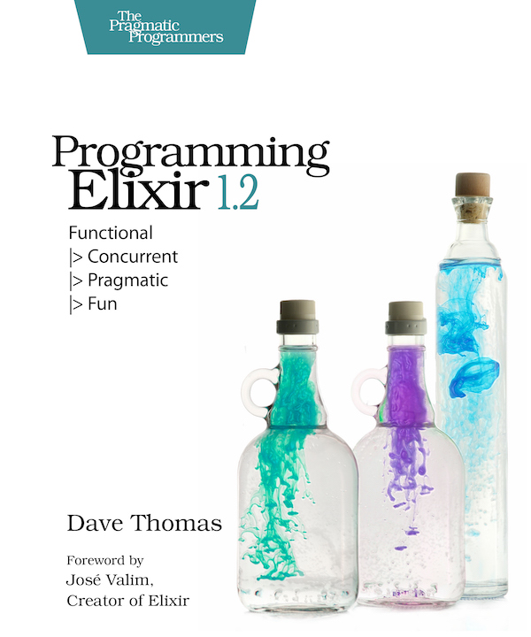
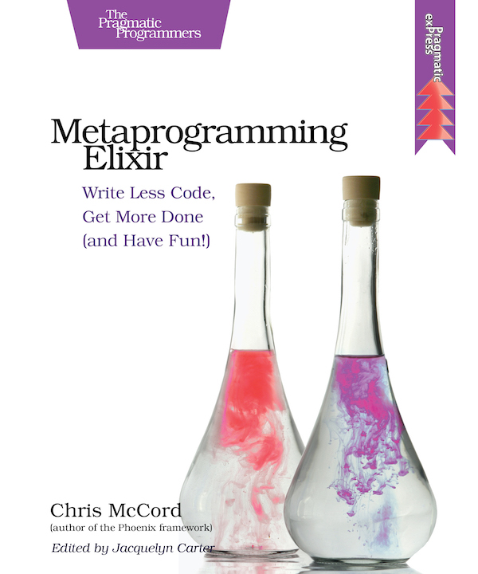

autoscale: true
footer: © binarytemple, 2016
slidenumbers: true

# Building microservices with Elixir and Docker

Startup tech pack - Thursday, April 28, 2016

* [binarytemple.co.uk](http://binarytemple.co.uk)
* [github.com/binarytemple](http://github.com/binarytemple)
* [linkedin.com/in/binarytemple](http://linkedin.com/in/binarytemple) 

---

Goals of this talk

* How to write a micro-service in Elixir
* Demonstrate how Elixir survives failure
* How to bake it into a Docker image
* How to perform simple CI using Codeship

If there is any time left...

* How to use docker-compose with for acceptance testing using chromedriver

And if you want to chat later..

* How to build and run Riak from within Docker

---

Grab some images

hub.docker.com

[`/r/binarytemple/docker-phoenix`](https://hub.docker.com/r/binarytemple/docker-phoenix)
[`/r/binarytemple/elixir_plug_poc`](https://hub.docker.com/r/binarytemple/elixir_plug_poc)
[`/r/binarytemple/phoenix_commerce_dev`](https://hub.docker.com/r/binarytemple/phoenix_commerce_dev)
[`/r/binarytemple/riak `](https://hub.docker.com/r/binarytemple/riak)

---

# Why not choose OOP language X?

On a whiteboard it starts out like this [^1]. "Lets describe an elegant taxonomy in order to better represent the system".

* Modularity 
* Code reuse
* Encapsulation

---

Money being burnt. Armies of code monkeys working away on projects like [^2] :

* £40m GP data extraction system; 
* £215m Common Agricultural Policy IT system
* £1.1bn e-borders system
* FizzBuzzEnterpriseEdition

And government procurement isn't the only place where this money is getting lost

---

OOP was made for writing

* Windowing systems
* GUI components
* Single player games

---

7databases.jpg
cmelixir.jpg
docker.png
elixir-sips.png
elixir12.jpg
herbert-fractal.png
oop.png
phoenix-logo.png
phoenix.jpg
riak.png
tech-codeship.png

---

Seven Languages in Seven Weeks
Clojure, Haskell, Io, Prolog, Scala, Erlang, and Ruby

---

---

Why I got interested in Erlang

---

Issues with Erlang

---

Why I got interested in Elixir 

---

Timeline

---

Where Elixir wins

---

Books

    

^ Seven languages - First piqued my interest
^ Programming Erlang - Erlang introductory text
^ Programming Phoenix - Phoenix lead and Elixir creator

---
[^1]: Original author unknown

[^2]: "Some of the recent reports on IT disasters by the body and the Public Accounts Committee include: the £40m GP data extraction system; the £215m Common Agricultural Policy IT system, which could also incur yearly fines of £180m from the EU; and the £1.1bn e-borders system" - source theregister.co.uk

---
