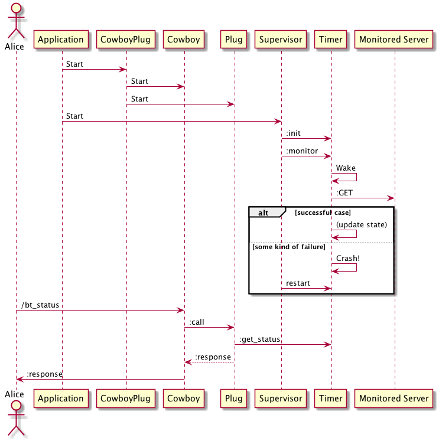
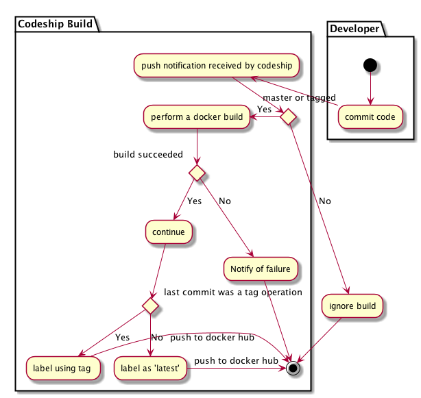

autoscale: true
footer: © binarytemple, 2016
slidenumbers: true

# Building microservices with Elixir and Docker

Startup tech pack - Thursday, April 28, 2016


* [binarytemple.co.uk](http://binarytemple.co.uk)
* [github.com/binarytemple](http://github.com/binarytemple)
* [linkedin.com/in/binarytemple](http://linkedin.com/in/binarytemple) 

---

# Goals of this talk

* What is a 'Plug'
* How to write a micro-service in Elixir
* Demonstrate how Elixir (BEAM actually) survives failure
* How to bake an Elixir application into a Docker image
* How to perform simple CI using Codeship

And if you want to chat later..

* How to build and run Riak from within Docker
* How to use docker-compose for acceptance testing with Chromedriver
* Anything else to do with Docker or Elixir

---

Grab some images

hub.docker.com

[`/r/binarytemple/docker-phoenix`](https://hub.docker.com/r/binarytemple/docker-phoenix)
[`/r/binarytemple/elixir_plug_poc`](https://hub.docker.com/r/binarytemple/elixir_plug_poc)
[`/r/binarytemple/phoenix_commerce_dev`](https://hub.docker.com/r/binarytemple/phoenix_commerce_dev)
[`/r/binarytemple/riak `](https://hub.docker.com/r/binarytemple/riak)

_Source code is in corresponding Github repository_

---



---

#Getting started

The absolute minimum - a web server -

```
 % find mix.exs ./lib ./test
 mix.exs
 ./lib/elixir_plug_poc.ex
 ./test/elixir_plug_poc_test.exs
 ./test/test_helper.exs
```
---

Mix build file 

```elixir
defmodule ElixirPlugPoc.Mixfile do
  use Mix.Project

  def project do
    [app: :elixir_plug_poc,
     version: "0.0.1",
     elixir: "~> 1.2",
     build_embedded: Mix.env == :prod,
     start_permanent: Mix.env == :prod,
     deps: deps]
  end

  def application do
    [
      applications: [:logger]
    ]
  end

  defp deps do
    [
      {:plug, "~> 1.0"},
      {:cowboy, "~> 1.0"}
    ]
  end
end
```
---

# The most trivial plug

```elixir
defmodule HelloWorldPlug do

  import Plug.Conn

  def init(opts) do
    Map.put(opts, :my_prefix, "Hello")
  end

  def call(%Plug.Conn{request_path: "/" } = conn, opts) do
    send_resp(conn, 200, "#{opts[:my_prefix]}, World!")
  end

  def call(%Plug.Conn{request_path: "/" <> name} = conn, opts) do
    send_resp(conn, 200, "Hello, #{name}!")
  end

end
```

---

# Prep 

```
mix deps.get
```

# Starting it up

```erl
% iex -S mix   
Erlang/OTP 18 [erts-7.3] [source] [64-bit] [smp:8:8] [async-threads:10] [hipe] [kernel-poll:false] [dtrace]
....
Interactive Elixir (1.2.4) - press Ctrl+C to exit (type h() ENTER for help)
iex(1)> 
nil
iex(2)> Plug.Adapters.Cowboy.http(HelloWorldPlug, %{})
{:ok, #PID<0.180.0>}
```

--- 

# Testing 

```elixir
defmodule HelloWorldPlugTest do
  use ExUnit.Case
  use ExUnit.Case, async: true
  use Plug.Test

  @opts HelloWorldPlug.init(%{})

  test "returns 'Hello, Torben!'" do
 
    conn = conn(:get, "/Torben")

    # Invoke the plug
    conn = HelloWorldPlug.call(conn, @opts)

    assert conn.state == :sent
    assert conn.status == 200
    assert conn.resp_body == "Hello, Torben!"
  end

end

```

---

# Lets add some more stuff

---

# Auto start

Define an application module

```elixir
defmodule HelloWorld do
  use Application

  def start(_type, _args) do
      Plug.Adapters.Cowboy.http(HelloWorldPlug, %{})
  end
end
```
---

Add the Application to `mix.exs`

```elixir
defmodule ElixirPlugPoc.Mixfile do
  ....
  def application do
    [ 
      mod: {HelloWorld, []},
      applications: [:logger]
    ]
  end
  ...
end
```

---

# Continous Integration

Oops.. I Forgot to mention Docker and Codeship


---



---

# Dockerfile

```dockerfile

FROM elixir

MAINTAINER admin@binarytemple.co.uk

EXPOSE 4000

RUN mix local.hex --force && mix local.rebar --force && mix hex.info

RUN apt-get update -y && apt-get install -y curl vim

WORKDIR /elixir_plug_poc

COPY ./mix* ./

ENV MIX_ENV=test

RUN mix hex.info && mix do deps.get

COPY . . 

RUN mix test

ENV MIX_ENV=dev

RUN mix compile

CMD ["/bin/bash"]

```

---

# Standard Docker workflow commands

Create the image
```
docker build . 
```
Create the image with a tag
```
docker build -t org/project:version
```
Run a specific image
```
docker run -ti org/project:version
```
Push a specific image to docker hub
```
docker push org/project:version
```

---

# Codeship

---

### `codeship-services.yml` ~ Specify the build 

```
app:
  build:
    image: binarytemple/elixir_plug_poc
    dockerfile_path: Dockerfile
  environment:
```

---

### `codeship-steps.yml` ~ Specify the CI steps

```
- service: app
  type: push
  image_name: binarytemple/elixir_plug_poc
  tag: ^([0-9]+\.[0-9]+\.[0-9]+.*)$
  image_tag: "{{.Branch}}"
  registry: https://index.docker.io/v1/
  encrypted_dockercfg_path: dockercfg.encrypted

- service: app
  type: push
  image_name: binarytemple/elixir_plug_poc
  tag: "master"
  image_tag: "latest"
  registry: https://index.docker.io/v1/
  encrypted_dockercfg_path: dockercfg.encrypted
```

-- __Uses Go templating but no support for conditional logic, hence the duplication__

---

### Keeping secrets secret

(But I wish they implemented asymetric encryption)

```
mv ~/Downloads/elixir_plug_poc_codeship.aes codeship.aes
jet encrypt ${HOME}/.docker/config.json dockercfg.encrypted
```
^ never check `codeship.aes` in to version control, also make sure to add it to `.dockerignore` 

---

# Back to Elixir.. 

---

Lets add a process to watch a particular web server 

```elixir
defmodule HelloWorld.Timer do
  use GenServer
  @time_30_sec "30 * 1000"
  @time_10_sec "10 * 1000"
  def start_link do
    GenServer.start_link(__MODULE__, %{}, [name: __MODULE__])
  end
  defp eval(time) do
    Code.eval_string(time) |> Tuple.to_list  |> List.first
  end
  def init(state) do
    Process.send_after(self(), :work, eval(@time_10_sec))
    {:ok, state}
  end
  def is_it_up() do
    GenServer.call( __MODULE__, :is_it_up,50)
  end
  def handle_call(:is_it_up, _from, state) do
    case state do
      %{status: :up} -> { :reply, { :ok, :up}, state }
      %{status: :bad_status} -> { :reply, { :ok, :bad_status}, state } ; _ ->  { :reply, { :ok, :unknown}, state }
    end
  end
  def handle_info(:work, state) do
    Process.send_after(self(), :work, eval(@time_30_sec))
    status = case HTTPoison.head! "http://binarytemple.co.uk" do
      %{status_code: 200 } -> :up
      _ -> :bad_status
    end
    IO.puts "Checked server status - #{inspect  :calendar.now_to_datetime(:erlang.timestamp) } - status is #{status}"
    {:noreply, Map.put(state, :status, status) }
  end
end
```

^ note how I made a call using `HTTPoison.head!` - methods suffixed with `!` raise an exception on error

--- 

# Starting the watcher

```
GenServer.start_link(HelloWorld.Timer, %{}, [:name :foo])
{:ok, #PID<0.288.0>}
```

__But when I disconnect my network it dies and stays dead__

```
17:30:06.242 [error] GenServer :foo terminating
** (HTTPoison.Error) :timeout
    (httpoison) lib/httpoison.ex:66: HTTPoison.request!/5
    (elixir_plug_poc) lib/timer.ex:36: HelloWorld.Timer.handle_info/2
    (stdlib) gen_server.erl:615: :gen_server.try_dispatch/4
    (stdlib) gen_server.erl:681: :gen_server.handle_msg/5
    (stdlib) proc_lib.erl:240: :proc_lib.init_p_do_apply/3
Last message: :work
State: %{status: :up}
```
---

# The solution : Supervisor

```
defmodule HelloWorld do
  use Application

  def start(_type, _args) do
      # Cowboy manages his own supervision tree.. no need for supervisor
      Plug.Adapters.Cowboy.http(HelloWorldPlug, %{})

      # Import helpers for defining supervisors
      import Supervisor.Spec

      children = [
        worker(HelloWorld.Timer,[])
      ]
      # Start the supervisor with our one child
      {:ok, pid} = Supervisor.start_link(children, strategy: :one_for_one)
  end
end
```

---

# Lets also make the routes a little friendlier

```elixir
defmodule HelloWorldPlug do
  import Plug.Conn

  def init(opts) do
    Map.put(opts, :my_prefix, "Hello")
  end

  def call(%Plug.Conn{request_path: "/" } = conn, opts) do
    available_routes = """
                       #{opts[:my_prefix]}, World!
                       /          - this message
                       /crash     - throw an exception, crash the plug process
                       /bt_status - check the status of binarytemple.co.uk
                       / <> name  - display a greeting followed by the specified name
                      """
    send_resp(conn, 200, "#{available_routes}")
  end

  def call(%Plug.Conn{request_path: "/crash" } = conn, opts) do
    raise "deliberate exception"
  end

  def call(%Plug.Conn{request_path: "/bt_status" } = conn, opts) do
    case HelloWorld.Timer.is_it_up do
      {:ok, :up} -> send_resp(conn, 200, "binarytemple.co.uk - status - good" )
      {:ok, :bad_status} -> send_resp(conn, 200, "binarytemple.co.uk - status - bad")
      _ ->  send_resp(conn, 200, "binarytemple.co.uk - status - unknown")
    end
  end

  def call(%Plug.Conn{request_path: "/" <> name} = conn, opts) do
      greeting = "Hello, #{name}!" 
      conn |> 
      update_resp_header("x-greeting", greeting, &(&1)) |> 
      send_resp(200, greeting) 
  end

end
```

---

# And add a Pipeline

```
defmodule HelloWorldPipeline do
   
  # We use Plug.Builder to have access to the plug/2 macro.
  # This macro can receive a function or a module plug and an
  # optional parameter that will be passed unchanged to the 
  # given plug.
  use Plug.Builder

  plug Plug.Logger
  plug HelloWorldPlug, %{}

end
```

--- 

# Demo 

---

# Books

__Some reading recomendations__


    

^ Seven languages - First piqued my interest
^ Programming Erlang - Erlang introductory text
^ Programming Phoenix - Phoenix lead and Elixir creator

---

# A big shout out to 

Codeship :  For letting me use their service for free
Josh Adams (Elixir Sips) : For help and info
Basho : For learning me some Erlang
ESL/Trifork : For all their help
